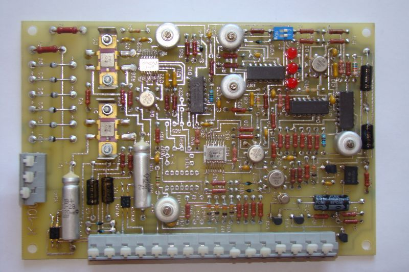

# K-100
Voltage corrector K-100

Корректор напряжения К-100 (БЦЖИ 687243.002) - предназначен для регулирования напряжения синхронных генераторов серии ГС-Б.

В репозитории содержатся: 
 - схема платы корректора К-100 
 - схема всего блока(ящика) генератора и плат установленных на генераторе
 - инструкция по настройке
 - инструкция по поиску и устранению неполадок

Схемы составлялись с изделия (примерно как на картинке выше) в ручную, поэтому возможны неточности.
